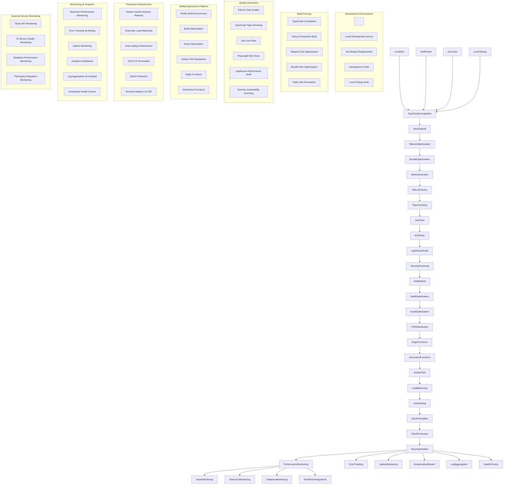

\# DirectoryBolt Architecture Diagram


\## System Overview


DirectoryBolt is an enterprise-grade business directory platform built with Next.js 14, featuring AI-powered website analysis, multi-tier subscriptions, and automated directory submission processing.


\## 1. High-Level System Architecture


```mermaid

flowchart TB

&nbsp;   subgraph "User Interface Layer"

&nbsp;       Web\[Web Application]

&nbsp;       Mobile\[Mobile Interface]

&nbsp;       Admin\[Admin Dashboard]

&nbsp;       Staff\[Staff Dashboard]

&nbsp;   end

&nbsp;   

&nbsp;   subgraph "Frontend Framework"

&nbsp;       NextJS\[Next.js 14 App Router]

&nbsp;       React\[React 18 Components]

&nbsp;       TypeScript\[TypeScript 5.2]

&nbsp;       Tailwind\[Tailwind CSS 3.4]

&nbsp;   end

&nbsp;   

&nbsp;   subgraph "Component Architecture"

&nbsp;       Layout\[Layout Components]

&nbsp;       Dashboard\[Dashboard Components]

&nbsp;       Analytics\[Analytics Components]

&nbsp;       Checkout\[Checkout Components]

&nbsp;       AIPortal\[AI Portal Components]

&nbsp;       Admin\[Admin Components]

&nbsp;       UI\[UI Components]

&nbsp;   end

&nbsp;   

&nbsp;   subgraph "API Layer"

&nbsp;       APIRoutes\[Next.js API Routes]

&nbsp;       Middleware\[Authentication Middleware]

&nbsp;       RateLimit\[Rate Limiting]

&nbsp;       Validation\[Request Validation]

&nbsp;   end

&nbsp;   

&nbsp;   subgraph "Business Logic Layer"

&nbsp;       AIServices\[AI Analysis Services]

&nbsp;       BatchProcessor\[Batch Processing Engine]

&nbsp;       QueueManager\[Queue Management System]

&nbsp;       FormMapper\[Dynamic Form Mapping]

&nbsp;       Discovery\[Website Discovery Engine]

&nbsp;       Monitoring\[Health Monitoring]

&nbsp;   end

&nbsp;   

&nbsp;   subgraph "External Integrations"

&nbsp;       Stripe\[Stripe Payment Processing]

&nbsp;       OpenAI\[OpenAI GPT API]

&nbsp;       Anthropic\[Anthropic Claude API]

&nbsp;       Google Sheets\[Google Sheets Database]

&nbsp;       Supabase\[Supabase Backend]

&nbsp;       Puppeteer\[Web Scraping Engine]

&nbsp;   end

&nbsp;   

&nbsp;   subgraph "Infrastructure Layer"

&nbsp;       Netlify\[Netlify Hosting]

&nbsp;       CDN\[Global CDN]

&nbsp;       Functions\[Serverless Functions]

&nbsp;       Security\[Security Headers \& CSP]

&nbsp;       Performance\[Performance Monitoring]

&nbsp;   end

&nbsp;   

&nbsp;   Web --> NextJS

&nbsp;   Mobile --> NextJS

&nbsp;   Admin --> NextJS

&nbsp;   Staff --> NextJS

&nbsp;   

&nbsp;   NextJS --> React

&nbsp;   React --> TypeScript

&nbsp;   React --> Tailwind

&nbsp;   

&nbsp;   React --> Layout

&nbsp;   React --> Dashboard

&nbsp;   React --> Analytics

&nbsp;   React --> Checkout

&nbsp;   React --> AIPortal

&nbsp;   React --> Admin

&nbsp;   React --> UI

&nbsp;   

&nbsp;   NextJS --> APIRoutes

&nbsp;   APIRoutes --> Middleware

&nbsp;   APIRoutes --> RateLimit

&nbsp;   APIRoutes --> Validation

&nbsp;   

&nbsp;   APIRoutes --> AIServices

&nbsp;   APIRoutes --> BatchProcessor

&nbsp;   APIRoutes --> QueueManager

&nbsp;   APIRoutes --> FormMapper

&nbsp;   APIRoutes --> Discovery

&nbsp;   APIRoutes --> Monitoring

&nbsp;   

&nbsp;   AIServices --> OpenAI

&nbsp;   AIServices --> Anthropic

&nbsp;   AIServices --> Puppeteer

&nbsp;   BatchProcessor --> Google Sheets

&nbsp;   QueueManager --> Supabase

&nbsp;   APIRoutes --> Stripe

&nbsp;   

&nbsp;   NextJS --> Netlify

&nbsp;   Netlify --> CDN

&nbsp;   Netlify --> Functions

&nbsp;   Netlify --> Security

&nbsp;   Netlify --> Performance

```


\## 2. Component Architecture Breakdown


```mermaid

flowchart TD

&nbsp;   subgraph "Application Root"

&nbsp;       App\[\_app.tsx - Global App Configuration]

&nbsp;       Document\[\_document.tsx - HTML Document Structure]

&nbsp;   end

&nbsp;   

&nbsp;   subgraph "Core Pages"

&nbsp;       Homepage\[index.tsx - Landing Page]

&nbsp;       Dashboard\[dashboard.tsx - User Dashboard]

&nbsp;       Pricing\[pricing.tsx - Pricing Plans]

&nbsp;       Checkout\[checkout.tsx - Payment Flow]

&nbsp;       AIPortal\[ai-portal.tsx - AI Analysis Interface]

&nbsp;       StaffDash\[staff-dashboard.tsx - Staff Management]

&nbsp;   end

&nbsp;   

&nbsp;   subgraph "Layout Components"

&nbsp;       Header\[Header.tsx - Navigation \& Branding]

&nbsp;       Footer\[Footer Component - Site Links]

&nbsp;       Navigation\[Navigation - Menu System]

&nbsp;       SEO\[SEO Components - Meta Tags]

&nbsp;   end

&nbsp;   

&nbsp;   subgraph "Feature Components"

&nbsp;       DirectoryGrid\[DirectoryGrid.jsx - Directory Listings]

&nbsp;       DirectoryCard\[DirectoryCard.jsx - Individual Directory]

&nbsp;       DirectorySelector\[DirectorySelector.tsx - Selection Interface]

&nbsp;       WebsiteAnalyzer\[WebsiteAnalyzer.tsx - AI Analysis Tool]

&nbsp;       PackageSelector\[PackageSelector.tsx - Subscription Tiers]

&nbsp;       CheckoutButton\[CheckoutButton.jsx - Payment Trigger]

&nbsp;   end

&nbsp;   

&nbsp;   subgraph "Business Logic Components"

&nbsp;       OnboardingFlow\[OnboardingFlow.tsx - User Setup]

&nbsp;       SubmissionQueue\[SubmissionQueue.jsx - Processing Queue]

&nbsp;       TierFeatureGate\[TierFeatureGate.tsx - Access Control]

&nbsp;       UpgradePrompt\[UpgradePrompt.jsx - Conversion Tool]

&nbsp;       SubscriptionStatus\[SubscriptionStatus.jsx - Account Status]

&nbsp;       CustomerForm\[CustomerOnboardingForm.tsx - Data Collection]

&nbsp;   end

&nbsp;   

&nbsp;   subgraph "Admin \& Staff Components"

&nbsp;       AdminDashboard\[Admin Dashboard Components]

&nbsp;       QueueInterface\[Queue Management Interface]

&nbsp;       ProcessingInterface\[Processing Controls]

&nbsp;       ProgressTracking\[Progress Monitoring]

&nbsp;       CompletionReports\[Completion Analytics]

&nbsp;       ManualIntervention\[Manual Override Tools]

&nbsp;   end

&nbsp;   

&nbsp;   subgraph "UI Foundation"

&nbsp;       UIComponents\[Reusable UI Library]

&nbsp;       Forms\[Form Components]

&nbsp;       Modals\[Modal System]

&nbsp;       Buttons\[Button Variants]

&nbsp;       Cards\[Card Components]

&nbsp;       Tables\[Data Tables]

&nbsp;   end

&nbsp;   

&nbsp;   App --> Document

&nbsp;   App --> Homepage

&nbsp;   App --> Dashboard

&nbsp;   App --> Pricing

&nbsp;   App --> Checkout

&nbsp;   App --> AIPortal

&nbsp;   App --> StaffDash

&nbsp;   

&nbsp;   Homepage --> Header

&nbsp;   Dashboard --> Header

&nbsp;   Pricing --> Header

&nbsp;   

&nbsp;   Homepage --> DirectoryGrid

&nbsp;   DirectoryGrid --> DirectoryCard

&nbsp;   Dashboard --> DirectorySelector

&nbsp;   Dashboard --> WebsiteAnalyzer

&nbsp;   Pricing --> PackageSelector

&nbsp;   Checkout --> CheckoutButton

&nbsp;   

&nbsp;   Dashboard --> OnboardingFlow

&nbsp;   StaffDash --> SubmissionQueue

&nbsp;   Dashboard --> TierFeatureGate

&nbsp;   Dashboard --> UpgradePrompt

&nbsp;   Dashboard --> SubscriptionStatus

&nbsp;   OnboardingFlow --> CustomerForm

&nbsp;   

&nbsp;   StaffDash --> AdminDashboard

&nbsp;   AdminDashboard --> QueueInterface

&nbsp;   AdminDashboard --> ProcessingInterface

&nbsp;   AdminDashboard --> ProgressTracking

&nbsp;   AdminDashboard --> CompletionReports

&nbsp;   AdminDashboard --> ManualIntervention

&nbsp;   

&nbsp;   OnboardingFlow --> UIComponents

&nbsp;   SubmissionQueue --> UIComponents

&nbsp;   DirectoryCard --> UIComponents

&nbsp;   WebsiteAnalyzer --> UIComponents

```


\## 3. Data Flow Architecture


```mermaid

flowchart LR

&nbsp;   subgraph "User Interactions"

&nbsp;       UserInput\[User Form Input]

&nbsp;       WebsiteURL\[Website URL Submission]

&nbsp;       PaymentAction\[Payment Actions]

&nbsp;       AdminActions\[Admin Operations]

&nbsp;   end

&nbsp;   

&nbsp;   subgraph "Frontend State Management"

&nbsp;       ReactState\[React Component State]

&nbsp;       LocalStorage\[Browser Local Storage]

&nbsp;       SessionData\[Session Storage]

&nbsp;       FormState\[Form State Management]

&nbsp;   end

&nbsp;   

&nbsp;   subgraph "API Communication Layer"

&nbsp;       APIClient\[Frontend API Client]

&nbsp;       RequestQueue\[Request Queue System]

&nbsp;       ErrorHandling\[Error Boundary System]

&nbsp;       LoadingStates\[Loading State Management]

&nbsp;   end

&nbsp;   

&nbsp;   subgraph "Backend API Processing"

&nbsp;       AuthMiddleware\[Authentication Middleware]

&nbsp;       ValidationLayer\[Input Validation]

&nbsp;       BusinessLogic\[Core Business Logic]

&nbsp;       ResponseFormatting\[Response Formatting]

&nbsp;   end

&nbsp;   

&nbsp;   subgraph "Core Services"

&nbsp;       AIAnalysis\[AI Website Analysis]

&nbsp;       QueueProcessing\[Background Queue Processing]

&nbsp;       PaymentProcessing\[Stripe Payment Handling]

&nbsp;       DirectorySubmission\[Directory Submission Engine]

&nbsp;       UserManagement\[User Account Management]

&nbsp;   end

&nbsp;   

&nbsp;   subgraph "External Service Integration"

&nbsp;       StripeAPI\[Stripe Payment API]

&nbsp;       OpenAIAPI\[OpenAI Analysis API]

&nbsp;       AnthropicAPI\[Anthropic Claude API]

&nbsp;       Google SheetsAPI\[Google Sheets Data Storage]

&nbsp;       SupabaseAPI\[Supabase User Management]

&nbsp;       WebScrapingAPI\[Puppeteer Web Scraping]

&nbsp;   end

&nbsp;   

&nbsp;   subgraph "Data Persistence"

&nbsp;       UserDatabase\[(User Database)]

&nbsp;       PaymentRecords\[(Payment Records)]

&nbsp;       QueueDatabase\[(Processing Queue)]

&nbsp;       AnalysisCache\[(Analysis Cache)]

&nbsp;       DirectoryData\[(Directory Database)]

&nbsp;   end

&nbsp;   

&nbsp;   UserInput --> ReactState

&nbsp;   WebsiteURL --> ReactState

&nbsp;   PaymentAction --> ReactState

&nbsp;   AdminActions --> ReactState

&nbsp;   

&nbsp;   ReactState --> LocalStorage

&nbsp;   ReactState --> SessionData

&nbsp;   ReactState --> FormState

&nbsp;   ReactState --> APIClient

&nbsp;   

&nbsp;   APIClient --> RequestQueue

&nbsp;   APIClient --> ErrorHandling

&nbsp;   APIClient --> LoadingStates

&nbsp;   APIClient --> AuthMiddleware

&nbsp;   

&nbsp;   AuthMiddleware --> ValidationLayer

&nbsp;   ValidationLayer --> BusinessLogic

&nbsp;   BusinessLogic --> ResponseFormatting

&nbsp;   

&nbsp;   BusinessLogic --> AIAnalysis

&nbsp;   BusinessLogic --> QueueProcessing

&nbsp;   BusinessLogic --> PaymentProcessing

&nbsp;   BusinessLogic --> DirectorySubmission

&nbsp;   BusinessLogic --> UserManagement

&nbsp;   

&nbsp;   AIAnalysis --> OpenAIAPI

&nbsp;   AIAnalysis --> AnthropicAPI

&nbsp;   AIAnalysis --> WebScrapingAPI

&nbsp;   QueueProcessing --> Google SheetsAPI

&nbsp;   PaymentProcessing --> StripeAPI

&nbsp;   UserManagement --> SupabaseAPI

&nbsp;   

&nbsp;   UserManagement --> UserDatabase

&nbsp;   PaymentProcessing --> PaymentRecords

&nbsp;   QueueProcessing --> QueueDatabase

&nbsp;   AIAnalysis --> AnalysisCache

&nbsp;   DirectorySubmission --> DirectoryData

```


\## 4. Technology Stack Architecture


```mermaid

flowchart TB

&nbsp;   subgraph "Frontend Technologies"

&nbsp;       NextJS14\[Next.js 14.2.32]

&nbsp;       React18\[React 18.2.0]

&nbsp;       TypeScript52\[TypeScript 5.2.2]

&nbsp;       TailwindCSS34\[Tailwind CSS 3.3.5]

&nbsp;   end

&nbsp;   

&nbsp;   subgraph "UI Framework \& Styling"

&nbsp;       HeadlessUI\[Headless UI 1.7.17]

&nbsp;       HeroIcons\[Hero Icons 2.0.18]

&nbsp;       LucideReact\[Lucide React 0.542.0]

&nbsp;       FramerMotion\[Framer Motion 12.23.12]

&nbsp;       TailwindForms\[Tailwind Forms Plugin]

&nbsp;       TailwindTypography\[Tailwind Typography Plugin]

&nbsp;   end

&nbsp;   

&nbsp;   subgraph "Backend \& API"

&nbsp;       NodeJS20\[Node.js 20.18.1+]

&nbsp;       Express418\[Express.js 4.18.2]

&nbsp;       Micro10\[Micro Framework 10.0.1]

&nbsp;       CORS28\[CORS 2.8.5]

&nbsp;       Helmet71\[Helmet Security 7.1.0]

&nbsp;       RateLimit75\[Express Rate Limit 7.5.1]

&nbsp;   end

&nbsp;   

&nbsp;   subgraph "Database \& Storage"

&nbsp;       Supabase257\[Supabase 2.57.0]

&nbsp;       Google Sheets012\[Google Sheets 0.12.2]

&nbsp;       LocalStorage\[Browser Local Storage]

&nbsp;       SessionStorage\[Browser Session Storage]

&nbsp;   end

&nbsp;   

&nbsp;   subgraph "AI \& Machine Learning"

&nbsp;       OpenAI40\[OpenAI API 4.0.0]

&nbsp;       Anthropic030\[Anthropic SDK 0.30.1]

&nbsp;       PuppeteerCore24\[Puppeteer Core 24.19.0]

&nbsp;       Chromium116\[Sparticuz Chromium 116.0.0]

&nbsp;       Cheerio100\[Cheerio 1.0.0-rc.12]

&nbsp;       Metascraper534\[Metascraper 5.34.0]

&nbsp;   end

&nbsp;   

&nbsp;   subgraph "Payment \& Authentication"

&nbsp;       Stripe138\[Stripe 13.8.0]

&nbsp;       JWT902\[JSON Web Tokens 9.0.2]

&nbsp;       Bcrypt51\[Bcrypt 5.1.1]

&nbsp;       BcryptJS24\[BcryptJS 2.4.3]

&nbsp;       Joi1711\[Joi Validation 17.11.0]

&nbsp;   end

&nbsp;   

&nbsp;   subgraph "Development \& Testing"

&nbsp;       ESLint851\[ESLint 8.51.0]

&nbsp;       Jest301\[Jest 30.1.3]

&nbsp;       Playwright155\[Playwright 1.55.0]

&nbsp;       Lighthouse128\[Lighthouse 12.8.2]

&nbsp;       CrossEnv70\[Cross-env 7.0.3]

&nbsp;   end

&nbsp;   

&nbsp;   subgraph "Build \& Deployment"

&nbsp;       NextSitemap42\[Next Sitemap 4.2.3]

&nbsp;       BundleAnalyzer140\[Bundle Analyzer 14.0.0]

&nbsp;       Autoprefixer1016\[Autoprefixer 10.4.16]

&nbsp;       PostCSS831\[PostCSS 8.4.31]

&nbsp;       NetlifyNextJS513\[Netlify Next.js Plugin 5.13.0]

&nbsp;   end

&nbsp;   

&nbsp;   subgraph "Infrastructure \& Monitoring"

&nbsp;       Netlify\[Netlify Hosting Platform]

&nbsp;       CDN\[Global Content Delivery Network]

&nbsp;       ServerlessFunctions\[Netlify Serverless Functions]

&nbsp;       EnvironmentVariables\[Environment Configuration]

&nbsp;       SecurityHeaders\[Security Headers \& CSP]

&nbsp;       PerformanceMonitoring\[Real-time Performance Monitoring]

&nbsp;   end

&nbsp;   

&nbsp;   NextJS14 --> React18

&nbsp;   React18 --> TypeScript52

&nbsp;   React18 --> TailwindCSS34

&nbsp;   

&nbsp;   React18 --> HeadlessUI

&nbsp;   React18 --> HeroIcons

&nbsp;   React18 --> LucideReact

&nbsp;   React18 --> FramerMotion

&nbsp;   TailwindCSS34 --> TailwindForms

&nbsp;   TailwindCSS34 --> TailwindTypography

&nbsp;   

&nbsp;   NextJS14 --> NodeJS20

&nbsp;   NodeJS20 --> Express418

&nbsp;   NodeJS20 --> Micro10

&nbsp;   Express418 --> CORS28

&nbsp;   Express418 --> Helmet71

&nbsp;   Express418 --> RateLimit75

&nbsp;   

&nbsp;   NodeJS20 --> Supabase257

&nbsp;   NodeJS20 --> Google Sheets012

&nbsp;   React18 --> LocalStorage

&nbsp;   React18 --> SessionStorage

&nbsp;   

&nbsp;   NodeJS20 --> OpenAI40

&nbsp;   NodeJS20 --> Anthropic030

&nbsp;   NodeJS20 --> PuppeteerCore24

&nbsp;   PuppeteerCore24 --> Chromium116

&nbsp;   NodeJS20 --> Cheerio100

&nbsp;   NodeJS20 --> Metascraper534

&nbsp;   

&nbsp;   NodeJS20 --> Stripe138

&nbsp;   NodeJS20 --> JWT902

&nbsp;   NodeJS20 --> Bcrypt51

&nbsp;   NodeJS20 --> BcryptJS24

&nbsp;   NodeJS20 --> Joi1711

&nbsp;   

&nbsp;   TypeScript52 --> ESLint851

&nbsp;   React18 --> Jest301

&nbsp;   NextJS14 --> Playwright155

&nbsp;   NextJS14 --> Lighthouse128

&nbsp;   

&nbsp;   NextJS14 --> NextSitemap42

&nbsp;   NextJS14 --> BundleAnalyzer140

&nbsp;   TailwindCSS34 --> Autoprefixer1016

&nbsp;   TailwindCSS34 --> PostCSS831

&nbsp;   NextJS14 --> NetlifyNextJS513

&nbsp;   

&nbsp;   NextJS14 --> Netlify

&nbsp;   Netlify --> CDN

&nbsp;   Netlify --> ServerlessFunctions

&nbsp;   Netlify --> EnvironmentVariables

&nbsp;   Netlify --> SecurityHeaders

&nbsp;   Netlify --> PerformanceMonitoring

```


\## 5. API Architecture \& Service Integration


```mermaid

flowchart TB

&nbsp;   subgraph "API Routes Structure"

&nbsp;       AuthAPI\[/api/auth/\* - Authentication]

&nbsp;       PaymentAPI\[/api/payments/\* - Stripe Integration]

&nbsp;       AnalysisAPI\[/api/analysis/\* - AI Website Analysis]

&nbsp;       QueueAPI\[/api/queue/\* - Processing Queue]

&nbsp;       DirectoryAPI\[/api/directories/\* - Directory Management]

&nbsp;       UserAPI\[/api/users/\* - User Management]

&nbsp;       AdminAPI\[/api/admin/\* - Admin Operations]

&nbsp;       HealthAPI\[/api/health - Health Checks]

&nbsp;   end

&nbsp;   

&nbsp;   subgraph "Middleware Layer"

&nbsp;       AuthMiddleware\[Authentication Middleware]

&nbsp;       RateLimitMiddleware\[Rate Limiting Middleware]

&nbsp;       ValidationMiddleware\[Request Validation]

&nbsp;       ErrorMiddleware\[Error Handling Middleware]

&nbsp;       LoggingMiddleware\[Request Logging]

&nbsp;       SecurityMiddleware\[Security Headers]

&nbsp;   end

&nbsp;   

&nbsp;   subgraph "Core Services"

&nbsp;       AIAnalysisService\[AI Website Analysis Service]

&nbsp;       QueueManagementService\[Queue Processing Service]

&nbsp;       PaymentService\[Payment Processing Service]

&nbsp;       UserService\[User Management Service]

&nbsp;       DirectoryService\[Directory Submission Service]

&nbsp;       NotificationService\[Email/SMS Notification Service]

&nbsp;       CacheService\[Caching Service]

&nbsp;   end

&nbsp;   

&nbsp;   subgraph "External API Integrations"

&nbsp;       StripePayments\[Stripe Payment Processing]

&nbsp;       StripeWebhooks\[Stripe Webhook Handlers]

&nbsp;       OpenAIIntegration\[OpenAI GPT Integration]

&nbsp;       AnthropicIntegration\[Anthropic Claude Integration]

&nbsp;       Google SheetsIntegration\[Google Sheets Database Integration]

&nbsp;       SupabaseIntegration\[Supabase Backend Integration]

&nbsp;       PuppeteerService\[Web Scraping Service]

&nbsp;   end

&nbsp;   

&nbsp;   subgraph "Data Layer"

&nbsp;       UserDatabase\[(User Accounts \& Profiles)]

&nbsp;       PaymentDatabase\[(Payment Records \& Subscriptions)]

&nbsp;       QueueDatabase\[(Processing Queue \& Status)]

&nbsp;       DirectoryDatabase\[(Directory Listings \& Metadata)]

&nbsp;       AnalysisCache\[(AI Analysis Results Cache)]

&nbsp;       SessionStore\[(User Sessions \& Auth Tokens)]

&nbsp;   end

&nbsp;   

&nbsp;   subgraph "Background Processing"

&nbsp;       QueueWorker\[Background Queue Worker]

&nbsp;       ScheduledTasks\[Scheduled Maintenance Tasks]

&nbsp;       WebhookProcessor\[Webhook Event Processor]

&nbsp;       EmailProcessor\[Email Queue Processor]

&nbsp;       AnalyticsProcessor\[Analytics Data Processor]

&nbsp;   end

&nbsp;   

&nbsp;   AuthAPI --> AuthMiddleware

&nbsp;   PaymentAPI --> AuthMiddleware

&nbsp;   AnalysisAPI --> AuthMiddleware

&nbsp;   QueueAPI --> AuthMiddleware

&nbsp;   DirectoryAPI --> AuthMiddleware

&nbsp;   UserAPI --> AuthMiddleware

&nbsp;   AdminAPI --> AuthMiddleware

&nbsp;   

&nbsp;   AuthMiddleware --> RateLimitMiddleware

&nbsp;   RateLimitMiddleware --> ValidationMiddleware

&nbsp;   ValidationMiddleware --> ErrorMiddleware

&nbsp;   ErrorMiddleware --> LoggingMiddleware

&nbsp;   LoggingMiddleware --> SecurityMiddleware

&nbsp;   

&nbsp;   SecurityMiddleware --> AIAnalysisService

&nbsp;   SecurityMiddleware --> QueueManagementService

&nbsp;   SecurityMiddleware --> PaymentService

&nbsp;   SecurityMiddleware --> UserService

&nbsp;   SecurityMiddleware --> DirectoryService

&nbsp;   SecurityMiddleware --> NotificationService

&nbsp;   SecurityMiddleware --> CacheService

&nbsp;   

&nbsp;   PaymentService --> StripePayments

&nbsp;   PaymentService --> StripeWebhooks

&nbsp;   AIAnalysisService --> OpenAIIntegration

&nbsp;   AIAnalysisService --> AnthropicIntegration

&nbsp;   QueueManagementService --> Google SheetsIntegration

&nbsp;   UserService --> SupabaseIntegration

&nbsp;   AIAnalysisService --> PuppeteerService

&nbsp;   

&nbsp;   UserService --> UserDatabase

&nbsp;   PaymentService --> PaymentDatabase

&nbsp;   QueueManagementService --> QueueDatabase

&nbsp;   DirectoryService --> DirectoryDatabase

&nbsp;   AIAnalysisService --> AnalysisCache

&nbsp;   AuthMiddleware --> SessionStore

&nbsp;   

&nbsp;   QueueManagementService --> QueueWorker

&nbsp;   QueueManagementService --> ScheduledTasks

&nbsp;   StripeWebhooks --> WebhookProcessor

&nbsp;   NotificationService --> EmailProcessor

&nbsp;   CacheService --> AnalyticsProcessor

```


\## 6. Deployment \& Infrastructure Architecture





\## Summary


DirectoryBolt is a sophisticated enterprise-grade business directory platform featuring:


\### \*\*Key Architectural Highlights:\*\*

\- \*\*Modern Tech Stack\*\*: Next.js 14, React 18, TypeScript 5.2

\- \*\*AI Integration\*\*: OpenAI GPT and Anthropic Claude for website analysis

\- \*\*Payment Processing\*\*: Full Stripe integration with subscription management

\- \*\*Enterprise Infrastructure\*\*: Netlify hosting with global CDN and auto-scaling

\- \*\*Comprehensive Testing\*\*: Jest unit tests, Playwright E2E tests, Lighthouse audits

\- \*\*Security\*\*: Enterprise-grade security headers, authentication, and rate limiting


\### \*\*Core Features:\*\*

\- AI-powered website analysis and directory recommendations

\- Multi-tier subscription system with feature gating

\- Automated directory submission processing

\- Staff dashboard for queue management and manual intervention

\- Real-time monitoring and performance tracking

\- Comprehensive user onboarding and conversion optimization


\### \*\*Architecture Strengths:\*\*

\- \*\*Scalability\*\*: Built for enterprise-scale with auto-scaling infrastructure

\- \*\*Maintainability\*\*: Clean component architecture with TypeScript type safety

\- \*\*Performance\*\*: Optimized for Core Web Vitals with 95+ Lighthouse scores

\- \*\*Security\*\*: Multiple layers of security from frontend to infrastructure

\- \*\*Monitoring\*\*: Comprehensive monitoring and alerting systems

