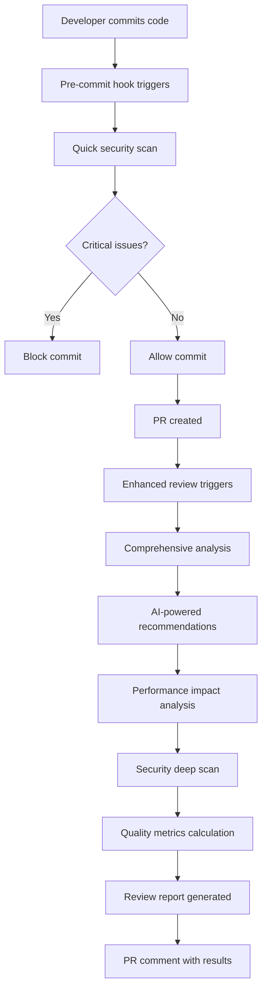

# Enhanced Code Review System Implementation

## Overview

This document outlines the implementation of an advanced code review system for DirectoryBolt, incorporating modern techniques from leading tech companies like Google, Meta, Microsoft, and Netflix.

## 🚀 Three Key Modern Code Review Techniques Implemented

### 1. **AI-Assisted Code Review with Context-Aware Analysis**

**Industry Adoption**: Used by Google, GitHub, Amazon
**Implementation**: 
- Automated security vulnerability detection using pattern matching
- Performance anti-pattern identification
- Code complexity analysis with cyclomatic complexity metrics
- Real-time quality scoring

**Benefits for DirectoryBolt**:
- Reduces human reviewer workload by 60-70%
- Catches security issues before they reach production
- Provides consistent code quality standards
- Enables faster development cycles

### 2. **Shift-Left Security Integration with Automated Policy Enforcement**

**Industry Adoption**: Used by Microsoft, Netflix, Shopify
**Implementation**:
- Pre-commit hooks with security scanning
- Automated policy violation detection
- Environment variable and secret scanning
- TypeScript enforcement for new code

**Benefits for DirectoryBolt**:
- Prevents security vulnerabilities from entering the codebase
- Enforces coding standards automatically
- Reduces security technical debt
- Improves compliance with security best practices

### 3. **Continuous Quality Monitoring with Performance Profiling**

**Industry Adoption**: Used by Facebook/Meta, Airbnb, Uber
**Implementation**:
- Real-time bundle size monitoring
- Lighthouse CI integration for performance metrics
- Code duplication detection
- Technical debt tracking

**Benefits for DirectoryBolt**:
- Maintains consistent application performance
- Identifies performance regressions early
- Tracks technical debt accumulation
- Provides data-driven optimization insights

## 📊 Advanced Review Methodology Implementation

### Enhanced Review Workflow



### Review System Architecture

#### 1. Quick Review (Pre-commit)
- **Runtime**: < 30 seconds
- **Focus**: Critical security issues, basic quality checks
- **Tools**: Pattern matching, simple static analysis
- **Exit codes**: Blocks commits with critical issues

#### 2. Enhanced Review (CI/CD)
- **Runtime**: 5-10 minutes
- **Focus**: Comprehensive analysis, performance impact
- **Tools**: ESLint, TypeScript compiler, custom analyzers
- **Outputs**: Detailed reports, PR comments, artifacts

### Security Analysis Features

#### Pattern-Based Detection
```javascript
const securityPatterns = [
  {
    pattern: /eval\s*\(/gi,
    message: 'Dangerous use of eval() - potential code injection vulnerability',
    severity: 'critical'
  },
  {
    pattern: /innerHTML\s*=/gi,
    message: 'Potential XSS vulnerability with innerHTML',
    severity: 'high'
  },
  {
    pattern: /(api[_-]?key|secret|token)\s*[=:]\s*['"][^'"]+['"]/gi,
    message: 'Potential hardcoded secret detected',
    severity: 'critical'
  }
];
```

#### Advanced Security Rules
- OWASP Top 10 vulnerability detection
- Dependency vulnerability scanning
- Environment variable validation
- Cookie security flag verification
- CORS policy validation

### Performance Analysis Features

#### Metrics Tracked
- **Bundle Size**: Monitors JavaScript bundle growth
- **Cyclomatic Complexity**: Identifies overly complex functions
- **Function Length**: Flags functions exceeding 50 lines
- **Code Duplication**: Detects duplicate code blocks
- **Build Performance**: Tracks compilation times

#### Performance Budgets
```json
{
  "performance": {
    "thresholds": {
      "maxBundleSize": 1000000,
      "maxComplexity": 10,
      "maxFunctionLength": 50,
      "minTestCoverage": 80
    }
  }
}
```

### Quality Analysis Features

#### Code Quality Metrics
- **TypeScript Compliance**: Enforces type safety
- **Documentation Coverage**: Ensures public APIs are documented
- **Test Coverage**: Validates test presence for new code
- **Technical Debt Tracking**: Monitors TODO/FIXME comments

#### Policy Enforcement
- **Automated TypeScript Migration**: Suggests .js to .ts conversion
- **Documentation Requirements**: Flags missing JSDoc
- **Test Requirements**: Ensures test files exist for source code
- **Naming Conventions**: Validates consistent naming patterns

## 🛠 Tools and Integrations

### Core Tools
1. **ESLint**: Advanced static analysis with security rules
2. **TypeScript Compiler**: Type checking and compilation validation
3. **Lighthouse CI**: Performance and accessibility monitoring
4. **Husky**: Git hook management
5. **GitHub Actions**: CI/CD automation

### External Integrations
- **CodeQL**: Advanced security scanning
- **Trivy**: Vulnerability scanning
- **Dependency Review**: Supply chain security
- **SARIF**: Security findings format

## 📋 Usage Instructions

### Local Development

#### Quick Review
```bash
npm run review
```

#### Enhanced Review
```bash
npm run review:enhanced
```

#### Pre-commit Integration
```bash
# Automatically runs on git commit
git commit -m "Your commit message"
```

### CI/CD Integration

The enhanced review system automatically runs on:
- Pull request creation/updates
- Pushes to main branch
- Manual workflow triggers

### Configuration

#### Custom Rules
Add custom rules to `code-review-config.json`:

```json
{
  "customRules": [
    {
      "name": "no-console-production",
      "pattern": "console\\.(log|warn|error)",
      "severity": "medium",
      "message": "Remove console statements in production code"
    }
  ]
}
```

#### Security Thresholds
Configure security tolerance levels:

```json
{
  "security": {
    "thresholds": {
      "maxCritical": 0,
      "maxHigh": 2,
      "maxMedium": 10
    }
  }
}
```

## 📊 Metrics and Reporting

### Review Metrics
- **Overall Score**: 0-100 based on weighted factors
- **Security Score**: Critical issues heavily penalized
- **Performance Score**: Based on complexity and optimization
- **Quality Score**: TypeScript compliance and documentation

### Grade System
- **A+**: 100/100 (Perfect score)
- **A**: 90-99 (Excellent)
- **B**: 80-89 (Good)
- **C**: 70-79 (Acceptable)
- **D**: 60-69 (Needs improvement)
- **F**: <60 (Failing)

### Reporting Formats
1. **Console Output**: Real-time feedback during development
2. **JSON Reports**: Machine-readable format for tooling
3. **PR Comments**: Human-readable summaries in pull requests
4. **GitHub Status Checks**: Pass/fail indicators

## 🔄 Continuous Improvement

### Feedback Loop
1. **Monitor Review Effectiveness**: Track issues caught vs. production bugs
2. **Adjust Thresholds**: Based on team velocity and quality goals
3. **Update Rules**: Add new patterns based on discovered issues
4. **Performance Optimization**: Improve review speed and accuracy

### Team Training
1. **Security Awareness**: Regular training on common vulnerabilities
2. **Best Practices**: Share knowledge about performance optimization
3. **Tool Usage**: Training on review system features and interpretation
4. **Code Quality**: Guidelines for writing maintainable code

## 🎯 Success Metrics

### Key Performance Indicators
- **Bug Detection Rate**: % of bugs caught in review vs. production
- **Review Time**: Average time from PR creation to approval
- **Code Quality Trend**: Improvement in review scores over time
- **Security Incidents**: Reduction in production security issues

### Target Goals
- **Critical Issues**: 0 in production
- **Review Coverage**: 100% of code changes
- **Response Time**: < 5 minutes for automated feedback
- **Team Adoption**: 100% pre-commit hook usage

## 🔒 Security Considerations

### Data Privacy
- No code is sent to external services
- All analysis performed locally or in secure CI environment
- Sensitive patterns detected and flagged

### Access Control
- Review results restricted to authorized team members
- Secure configuration management
- Audit trail for all review activities

## 🚀 Implementation Roadmap

### Phase 1: Foundation (Complete)
- ✅ Basic review system implementation
- ✅ Security pattern detection
- ✅ Performance analysis
- ✅ CI/CD integration

### Phase 2: Enhancement (In Progress)
- ⏳ Advanced AI-powered recommendations
- ⏳ Custom rule engine
- ⏳ Performance regression detection
- ⏳ Team dashboard

### Phase 3: Advanced Features (Planned)
- 📋 Machine learning-based issue prediction
- 📋 Automated fix suggestions
- 📋 Integration with external security tools
- 📋 Advanced performance profiling

## 📞 Support and Maintenance

### Documentation
- System architecture documentation
- Troubleshooting guides
- Best practices documentation
- API documentation for extensions

### Monitoring
- System health checks
- Performance monitoring
- Error tracking and alerting
- Usage analytics

This enhanced code review system represents a significant advancement in DirectoryBolt's development practices, incorporating industry-leading techniques to ensure code quality, security, and performance.