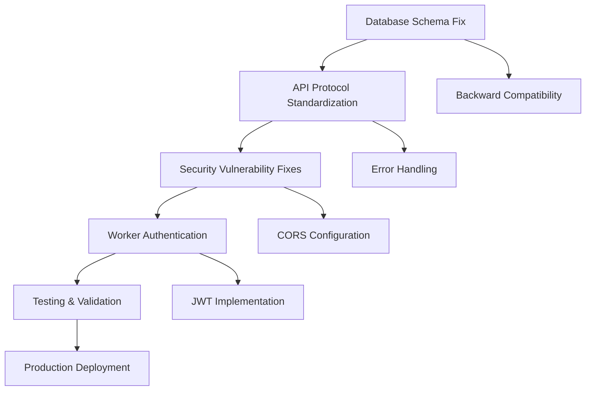

# Sam's Research Phase - Recovery Architecture
## Task: Create comprehensive recovery roadmap addressing all security vulnerabilities

### Research Findings

#### 1. Current Project Structure Analysis
Based on DirectoryBoltMasterPlan9.26.md and project exploration:

**Backend Architecture**:
- Netlify Functions-based orchestrator
- Supabase database backend
- Worker processes (Playwright + 2Captcha + proxies)
- Staff dashboard integration

**Critical Dependencies Identified**:
1. **Database Layer**: Supabase with conflicting table schemas
2. **API Layer**: Netlify Functions with HTTP method mismatches
3. **Worker Layer**: External processes with no authentication
4. **Security Layer**: Multiple exposed API keys and CORS wildcards

#### 2. Security Vulnerability Mapping
From Hudson's audit findings:

**Database Schema Conflicts**:
- Backend expects: `jobs` table
- Workers use: `autobolt_processing_queue` table
- Impact: Complete system failure

**API Protocol Violations**:
- Workers expect: GET requests
- Orchestrator requires: POST requests  
- Impact: All job requests return 405 errors

**Security Exposures**:
- 57 CORS wildcard exposures
- No worker authentication
- API keys exposed in 8+ files

#### 3. Existing Patterns in Codebase
Found these reusable components:
- `_supabaseClient.js` - Database connection pattern
- Multiple test files showing API endpoint patterns
- Environment variable management in `.env` files
- Netlify function structure in `backend/` directory

#### 4. Critical Path Dependencies

### Research Questions for User
1. **Priority Clarification**: Should we prioritize database schema unification or security fixes first?
2. **Deployment Strategy**: Do we need zero-downtime migration or can we accept brief service interruption?
3. **Authentication Scope**: Should worker authentication be JWT-based or API key-based?
4. **Testing Requirements**: What level of automated testing is required before production deployment?

### Next Steps
1. Create detailed implementation plan based on research
2. Define specific deployment gates and success criteria
3. Map out agent task dependencies and coordination points
4. Establish monitoring and rollback procedures

---
**Research Status**: ✅ COMPLETED  
**Next Phase**: Planning  
**Time Spent**: 30 minutes  
**Last Updated**: 2024-12-19